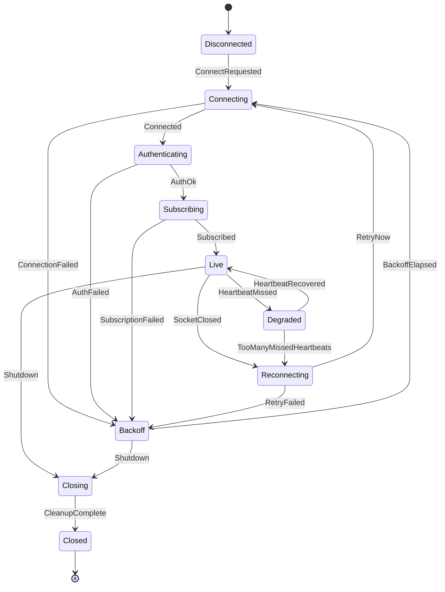

# graph validator

`tokio-fsm-macros` is the proc-macro crate for `tokio-fsm`. It parses `#[fsm]`
impl blocks, checks the state graph, then generates the runtime types.

The graph validator uses a pure, stateless model that operates on simple `(String, String)` edges rather than depending on `syn::Ident` or AST nodes. Tests can call it directly with lists of strings instead of compiling Rust fixture files.

The WebSocket fixture models a market-data client with 10 states and 17 edges. QuickCheck generates bitmasks over the 17 edges to produce arbitrary subgraphs and verifies properties against an independent reference implementation:

- Unreachable-state diagnostics exactly match a reference forward walk (BFS) from the initial state.
- The validator correctly identifies reachability regardless of the subgraph generated.

